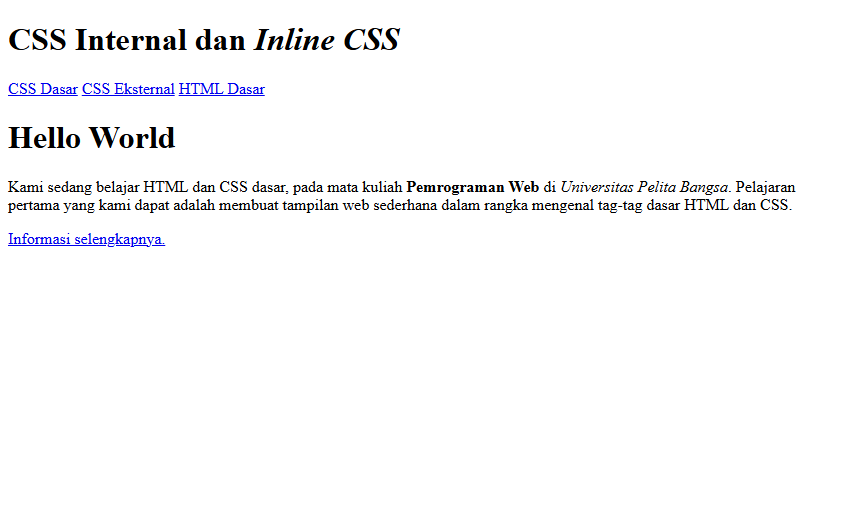
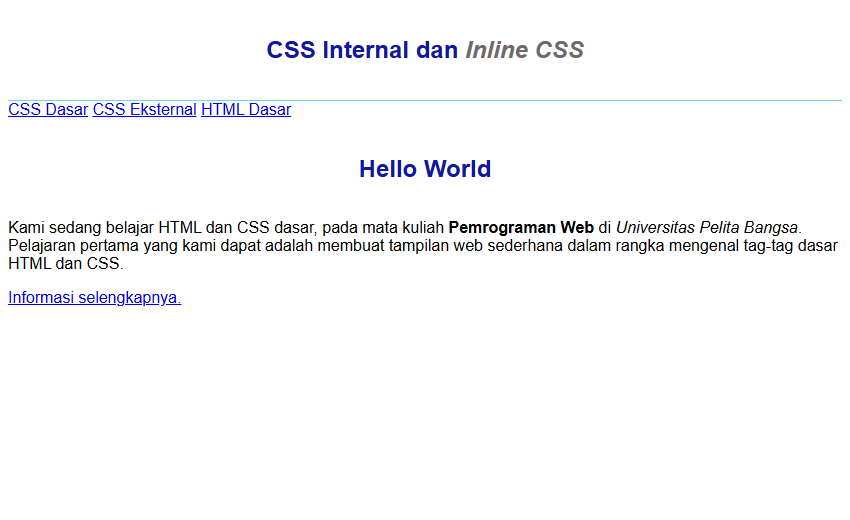
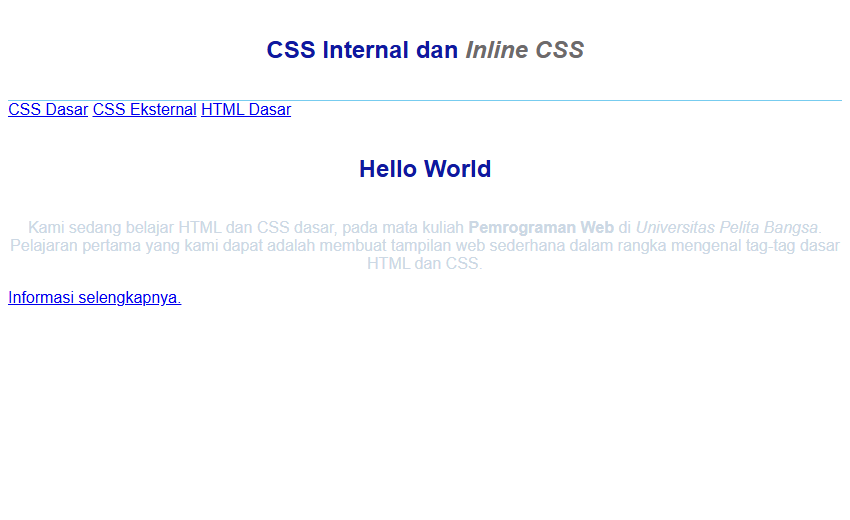
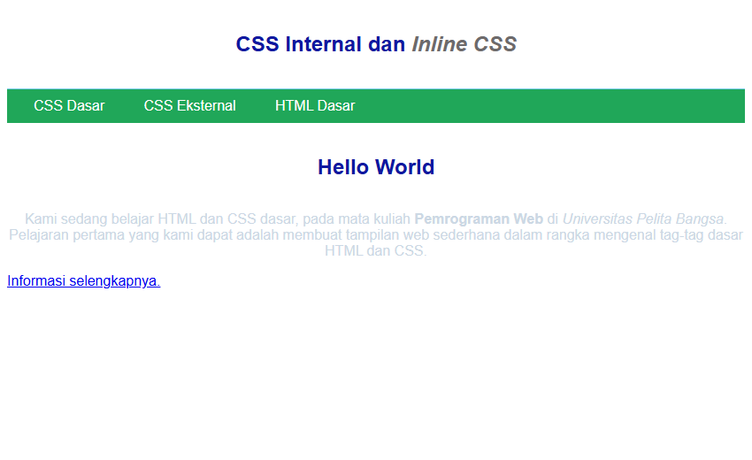
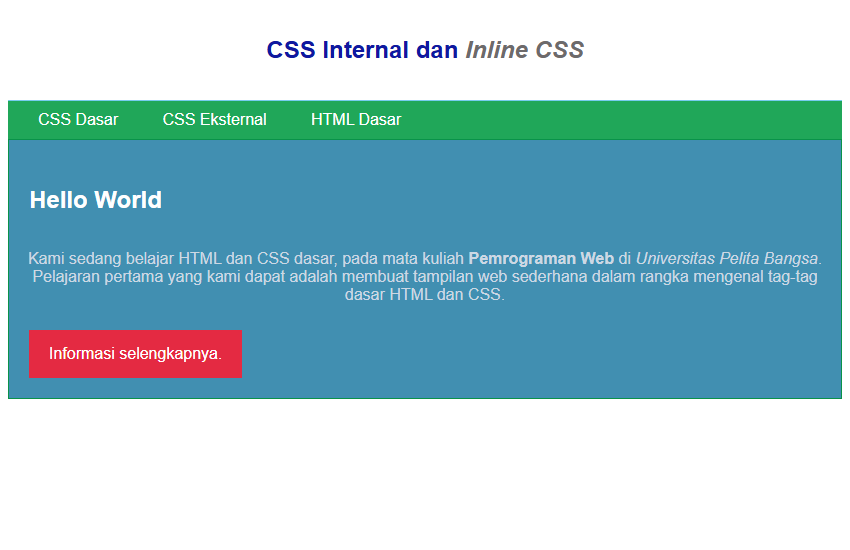
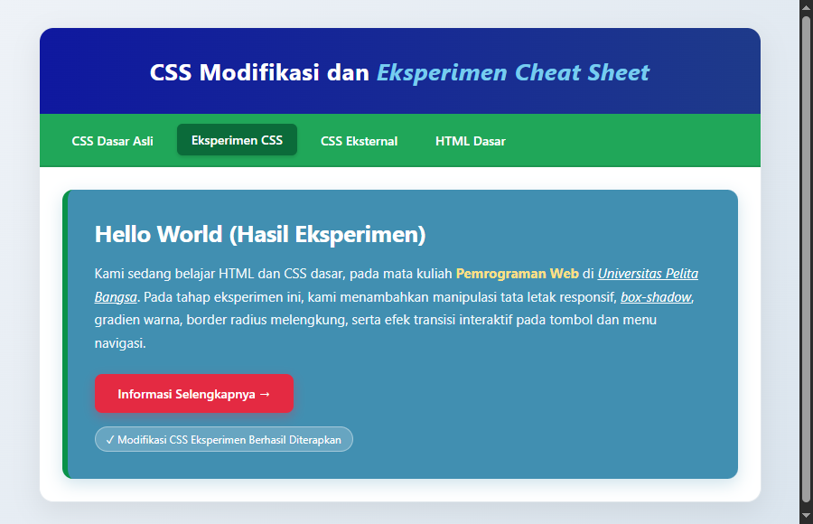
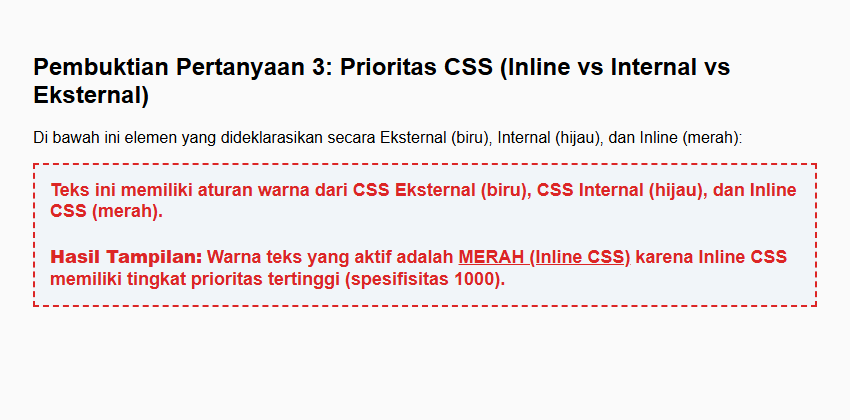
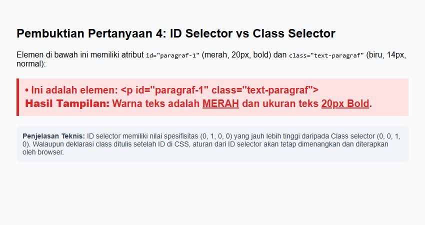

# Laporan Praktikum 3: CSS Dasar

**Mata Kuliah:** Pemrograman Web  
**Dosen Pengampu:** Agung Nugroho, S.Kom., M.Kom.  
**Institusi:** Universitas Pelita Bangsa  

---

## 📌 Identitas Mahasiswa
| Data | Keterangan |
| :--- | :--- |
| **Nama** | [Nama Mahasiswa] |
| **NIM** | [NIM Mahasiswa] |
| **Kelas** | [Kelas] |
| **Program Studi** | Teknik Informatika |

---

## 🎯 Tujuan Praktikum
1. Mahasiswa mampu memahami konsep dasar Cascading Style Sheets (CSS).
2. Mahasiswa mampu memahami aturan penulisan CSS (Inline, Internal, dan Eksternal).
3. Mahasiswa mampu memahami penggunaan selector (Elemen Selector, Class Selector, dan ID Selector) sebagai pengontrol gaya tampilan.
4. Mahasiswa mampu mengintegrasikan dan menerapkan pengaturan CSS pada halaman HTML.

---

## 📁 Struktur Direktori Repository
```text
Lab3Web/
├── lab1_tag_dasar.html          # Halaman pendukung (menu navigasi)
├── lab2_css_dasar.html          # File utama latihan praktikum CSS dasar
├── lab2_css_eksternal.html      # Halaman pendukung demonstrasi eksternal CSS
├── lab2_css_eksperimen.html     # Halaman hasil tugas eksperimen CSS
├── style_eksternal.css          # Berkas CSS eksternal utama praktikum
├── style_eksperimen.css         # Berkas CSS modifikasi dan eksperimen cheat sheet
├── tugas_prioritas.html         # Dokumen demo pembuktian pertanyaan 3 (prioritas CSS)
├── tugas_prioritas.css          # Berkas CSS eksternal untuk pengujian pertanyaan 3
├── tugas_spesifisitas.html      # Dokumen demo pembuktian pertanyaan 4 (ID vs Class)
├── screenshots/                 # Folder tangkapan layar hasil praktikum
│   ├── 01_dokumen_html.png
│   ├── 02_css_internal.png
│   ├── 03_inline_css.png
│   ├── 04_css_eksternal.png
│   ├── 05_selector_id_class.png
│   ├── 06_eksperimen_css.png
│   ├── 07_prioritas_css.png
│   └── 08_id_vs_class.png
└── README.md                    # Laporan lengkap pelaksanaan praktikum
```

---

## 🚀 Langkah-Langkah Praktikum

### Langkah 1: Membuat Dokumen HTML Dasar
Pada tahap pertama, dibuat dokumen HTML dasar tanpa aturan CSS pada berkas `lab2_css_dasar.html`.

**Kode Program:**
```html
<!DOCTYPE html>
<html lang="en">
<head>
    <meta charset="UTF-8">
    <meta name="viewport" content="width=device-width, initial-scale=1.0">
    <title>CSS Dasar</title>
</head>
<body>
    <header>
        <h1>CSS Internal dan <i>Inline CSS</i></h1>
    </header>
    <nav>
        <a href="lab2_css_dasar.html">CSS Dasar</a>
        <a href="lab2_css_eksternal.html">CSS Eksternal</a>
        <a href="lab1_tag_dasar.html">HTML Dasar</a>
    </nav>
    <!-- CSS ID Selector -->
    <div id="intro">
        <h1>Hello World</h1>
        <p>Kami sedang belajar HTML dan CSS dasar, pada mata kuliah <b>Pemrograman Web</b> di <i>Universitas Pelita Bangsa</i>. Pelajaran pertama yang kami dapat adalah membuat tampilan web sederhana dalam rangka mengenal tag-tag dasar HTML dan CSS.</p>
        <!-- CSS Class Selector -->
        <a class="button btn-primary" href="#intro">Informasi selengkapnya.</a>
    </div>
</body>
</html>
```

**Hasil Tampilan di Browser:**


*Penjelasan:* Tampilan masih polos menggunakan format default dari web browser (*user agent stylesheet*) dengan font standar Times New Roman, tautan berwarna biru bergaris bawah, dan elemen bertumpuk secara vertikal.

---

### Langkah 2: Mendeklarasikan Internal CSS
Internal CSS ditambahkan di dalam tag `<head>` menggunakan pasangan tag `<style>...</style>` untuk mengatur tipografi global, header, dan elemen `h1`.

**Kode CSS Internal yang Ditambahkan:**
```html
<style>
    body {
        font-family: 'Open Sans', sans-serif;
    }
    header {
        min-height: 80px;
        border-bottom: 1px solid #77CCEF;
    }
    h1 {
        font-size: 24px;
        color: #0F189F;
        text-align: center;
        padding: 20px 10px;
    }
    h1 i {
        color: #6d6a6b;
    }
</style>
```

**Hasil Tampilan di Browser:**


*Penjelasan:* Seluruh teks halaman berubah font menjadi sans-serif (`Open Sans`). Bagian header memiliki garis bawah berwarna biru muda (`#77CCEF`), serta judul utama terpusat (*center*) dengan warna biru gelap (`#0F189F`) dan kata miring berbayang abu-abu (`#6d6a6b`).

---

### Langkah 3: Menambahkan Inline CSS
Inline CSS diterapkan langsung pada atribut `style` di dalam tag `<p>` pada kontainer `#intro`.

**Potongan Kode HTML:**
```html
<p style="text-align: center; color: #ccd8e4;">Kami sedang belajar HTML dan CSS dasar, pada mata kuliah <b>Pemrograman Web</b> di <i>Universitas Pelita Bangsa</i>. Pelajaran pertama yang kami dapat adalah membuat tampilan web sederhana dalam rangka mengenal tag-tag dasar HTML dan CSS.</p>
```

**Hasil Tampilan di Browser:**


*Penjelasan:* Teks paragraf berubah menjadi rata tengah (`text-align: center`) dan warnanya berubah menjadi abu-abu kebiruan muda (`#ccd8e4`). Aturan inline ini secara langsung menimpa gaya default browser untuk elemen paragraf tersebut.

---

### Langkah 4: Membuat dan Menghubungkan CSS Eksternal
Membuat berkas stylesheet terpisah bernama `style_eksternal.css` untuk mengatur navigasi situs, lalu menghubungkannya di dalam tag `<head>` menggunakan tag `<link>`.

**Kode pada `style_eksternal.css`:**
```css
nav {
    background: #20A759;
    color: #fff;
    padding: 10px;
}
nav a {
    color: #fff;
    text-decoration: none;
    padding: 10px 20px;
}
nav .active, 
nav a:hover {
    background: #0B6B3A;
}
```

**Tag Penghubung pada `lab2_css_dasar.html`:**
```html
<!-- menyisipkan css eksternal -->
<link rel="stylesheet" href="style_eksternal.css" type="text/css">
```

**Hasil Tampilan di Browser:**


*Penjelasan:* Bagian navigasi kini memiliki latar belakang hijau terang (`#20A759`), link menu menjadi berwarna putih tanpa garis bawah dengan bantalan (*padding*) yang rapi, serta memiliki efek perubahan warna saat disentuh kursor (*hover*).

---

### Langkah 5: Menambahkan Selector ID dan Class pada CSS Eksternal
Melengkapi `style_eksternal.css` dengan aturan untuk ID Selector (`#intro`, `#intro h1`) dan Class Selector (`.button`, `.btn-primary`).

**Tambahan Kode pada `style_eksternal.css`:**
```css
/* ID Selector */
#intro {
    background: #418fb1;
    border: 1px solid #099249;
    min-height: 100px;
    padding: 10px;
}
#intro h1 {
    text-align: left;
    border: 0;
    color: #fff;
}

/* Class Selector */
.button {
    padding: 15px 20px;
    background: #bebcbd;
    color: #fff;
    display: inline-block;
    margin: 10px;
    text-decoration: none;
}
.btn-primary {
    background: #E42A42;
}
```

**Hasil Tampilan di Browser:**


*Penjelasan:* Area `#intro` berubah menjadi kotak berwarna biru laut (`#418fb1`) dengan border hijau. Judul di dalamnya (`#intro h1`) diatur rata kiri dengan warna putih. Tautan tombol yang menggunakan class `.button` dan `.btn-primary` berubah bentuk menjadi tombol persegi berwarna merah menyala (`#E42A42`) dengan teks putih tebal.

---

## 🧪 Tugas 1: Eksperimen Modifikasi CSS (Cheat Sheet)
Sesuai instruksi tugas, dilakukan eksperimen pengembangan lebih lanjut dengan memadukan properti modern seperti:
- `box-shadow`: Memberikan bayangan elevasi halus pada kontainer dan tombol.
- `border-radius`: Membuat sudut membulat (*rounded corners*).
- `linear-gradient`: Menerapkan gradasi latar belakang dinamis pada body dan header.
- `transition` & `transform`: Memberikan animasi mikro saat kursor diarahkan ke tombol dan menu nav.
- `border-left` aksen: Menghadirkan garis vertikal sebagai aksen visual card intro.

File eksperimen tersimpan pada [`lab2_css_eksperimen.html`](lab2_css_eksperimen.html) dan [`style_eksperimen.css`](style_eksperimen.css).

**Hasil Tampilan Eksperimen:**


---

## 📝 Jawaban Pertanyaan dan Tugas Praktikum

### 1. Eksperimen Kode CSS
> *Tugas: Lakukan eksperimen dengan mengubah dan menambah properti dan nilai pada kode CSS dengan mengacu pada CSS Cheat Sheet.*

**Penjelasan:**  
Eksperimen telah diimplementasikan penuh pada file [`lab2_css_eksperimen.html`](lab2_css_eksperimen.html) dengan file CSS [`style_eksperimen.css`](style_eksperimen.css). Properti-properti yang ditambahkan antara lain:
- Tata letak kontainer dengan pembatas lebar (`max-width: 800px; margin: 0 auto;`).
- Gradasi warna latar belakang `linear-gradient(135deg, #eef2f7 0%, #dbe5ee 100%)`.
- Efek hover interaktif dengan transisi halus `transition: all 0.3s ease; transform: translateY(-2px);`.
- Penataan tipografi yang lebih terbaca dengan `line-height: 1.7` dan `letter-spacing`.

---

### 2. Perbedaan Selector `h1 {...}` dengan `#intro h1 {...}`
> *Pertanyaan: Apa perbedaan pendeklarasian CSS elemen `h1 {...}` dengan `#intro h1 {...}`? Berikan penjelasannya!*

**Penjelasan:**
1. **Selector `h1 {...}` (Element/Type Selector):**
   - Bersifat **global**.
   - Aturan ini berlaku untuk **seluruh** elemen `<h1>` yang ada di halaman web tanpa terkecuali, baik yang berada di dalam header, intro, artikel, maupun footer.
   - Memiliki nilai spesifisitas rendah: `(0, 0, 0, 1)`.

2. **Selector `#intro h1 {...}` (Descendant Selector):**
   - Bersifat **spesifik dan terisolasi**.
   - Aturan ini hanya berlaku untuk elemen `<h1>` yang merupakan turunan (*descendant* / berada di dalam elemen ber-ID `intro`). Elemen `<h1>` di luar ID `intro` (seperti pada header) tidak akan terpengaruh.
   - Memiliki nilai spesifisitas jauh lebih tinggi: `(0, 1, 0, 1)` karena menggabungkan ID Selector dan Element Selector.
   - Aturan pada `#intro h1` akan menimpa (*override*) aturan dari `h1` biasa apabila terjadi benturan properti (misalnya pada warna atau perataan teks).

---

### 3. Tingkat Prioritas: Internal vs Eksternal vs Inline CSS
> *Pertanyaan: Apabila ada deklarasi CSS secara internal, lalu ditambahkan CSS eksternal dan inline CSS pada elemen yang sama. Deklarasi manakah yang akan ditampilkan pada browser? Berikan penjelasan dan contohnya!*

**Penjelasan:**
Browser menerapkan konsep **Cascading & Specificity Hierarchy** dalam menentukan urutan prioritas:
1. **Prioritas Tertinggi (Menang): `Inline CSS`**  
   Atribut `style="..."` langsung menempel pada elemen HTML dan memiliki bobot spesifisitas tertinggi (nilai: 1000). Oleh karena itu, nilainya akan selalu ditampilkan di browser mengalahkan Internal maupun Eksternal CSS (kecuali ada flag `!important`).
2. **Prioritas Menengah: `Internal CSS` dan `Eksternal CSS`**  
   Keduanya memiliki bobot spesifisitas yang setara (level tag/rule). Jika terdapat properti yang sama, aturan yang **dideklarasikan paling terakhir** (urutan baris terbawah di dalam `<head>`) yang akan menimpa aturan sebelumnya (*rule of cascade order*).

**Bukti Demonstrasi Kode ([tugas_prioritas.html](tugas_prioritas.html)):**
```html
<!-- Eksternal: color: #2563eb (Biru) -->
<link rel="stylesheet" href="tugas_prioritas.css">

<!-- Internal: color: #16a34a (Hijau) -->
<style>
    .uji-prioritas { color: #16a34a; font-weight: bold; }
</style>

<!-- Inline: color: #dc2626 (Merah) -->
<div class="uji-prioritas" style="color: #dc2626;">
    Teks pengujian prioritas warna
</div>
```

**Hasil Tampilan Browser:**


*Hasil Pengujian:* Teks tampil berwarna **MERAH**, membuktikan bahwa **Inline CSS** menang mutlak atas Internal dan Eksternal CSS.

---

### 4. Prioritas Selector: ID Selector vs Class Selector
> *Pertanyaan: Pada sebuah elemen HTML terdapat ID dan Class, apabila masing-masing selector tersebut terdapat deklarasi CSS, maka deklarasi manakah yang akan ditampilkan pada browser? Berikan penjelasan dan contohnya! (`<p id="paragraf-1" class="text-paragraf">`)*

**Penjelasan:**
Deklarasi yang akan ditampilkan pada browser adalah **deklarasi dari ID Selector** (`#paragraf-1`).

**Dasar Teori (CSS Specificity Calculation):**
Perhitungan spesifisitas CSS dinilai dalam empat tingkatan `(Inline, ID, Class, Element)`:
- **ID Selector (`#paragraf-1`)**: Nilai bobot = **(0, 1, 0, 0)** = bernilai 100.
- **Class Selector (`.text-paragraf`)**: Nilai bobot = **(0, 0, 1, 0)** = bernilai 10.

Karena bobot ID Selector (100) jauh lebih besar daripada Class Selector (10), maka aturan pada ID Selector akan **selalu menang dan diterapkan oleh browser**, meskipun deklarasi Class Selector ditulis setelah deklarasi ID Selector di dalam berkas CSS.

**Bukti Demonstrasi Kode ([tugas_spesifisitas.html](tugas_spesifisitas.html)):**
```css
#paragraf-1 {
    color: #dc2626; /* Merah */
    font-size: 20px;
    font-weight: bold;
}

.text-paragraf {
    color: #2563eb; /* Biru */
    font-size: 14px;
}
```
```html
<p id="paragraf-1" class="text-paragraf">
    Uji coba perbandingan ID vs Class selector
</p>
```

**Hasil Tampilan Browser:**


*Hasil Pengujian:* Teks tampil berwarna **MERAH dengan ukuran 20px Bold**, membuktikan bahwa deklarasi **ID Selector** mengalahkan Class Selector.

---

## 💡 Kesimpulan
Dari praktikum yang telah dilakukan, dapat disimpulkan bahwa:
1. CSS mempermudah pemisahan antara struktur dokumen (HTML) dengan tata visual dan estetika (CSS).
2. Tiga metode penulisan CSS (Inline, Internal, Eksternal) memiliki fungsi dan cakupan penggunaan yang berbeda, di mana Eksternal CSS merupakan praktik terbaik (*best practice*) dalam pengembangan aplikasi web modern untuk kemudahan pemeliharaan kode.
3. Konsep *Cascading* dan *Specificity* menentukan aturan CSS mana yang dieksekusi browser ketika terjadi benturan aturan gaya, di mana Inline CSS mengalahkan stylesheet dokumen, dan ID Selector memiliki prioritas lebih tinggi dibanding Class maupun Element Selector.
